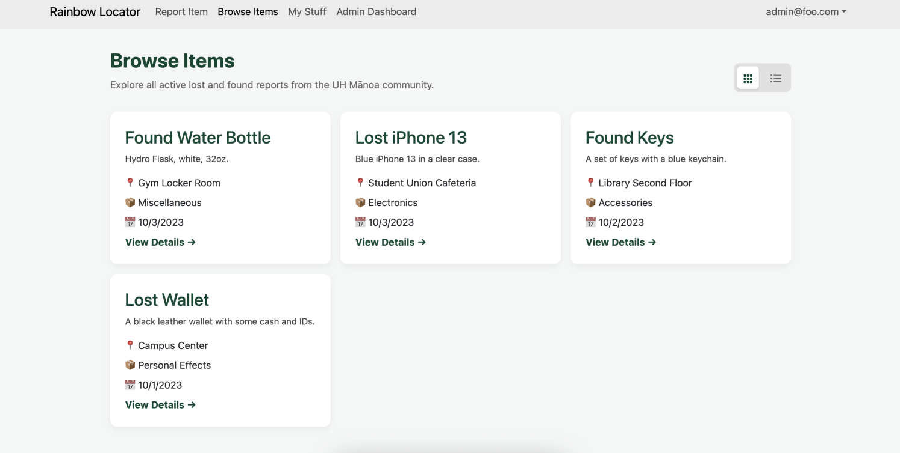
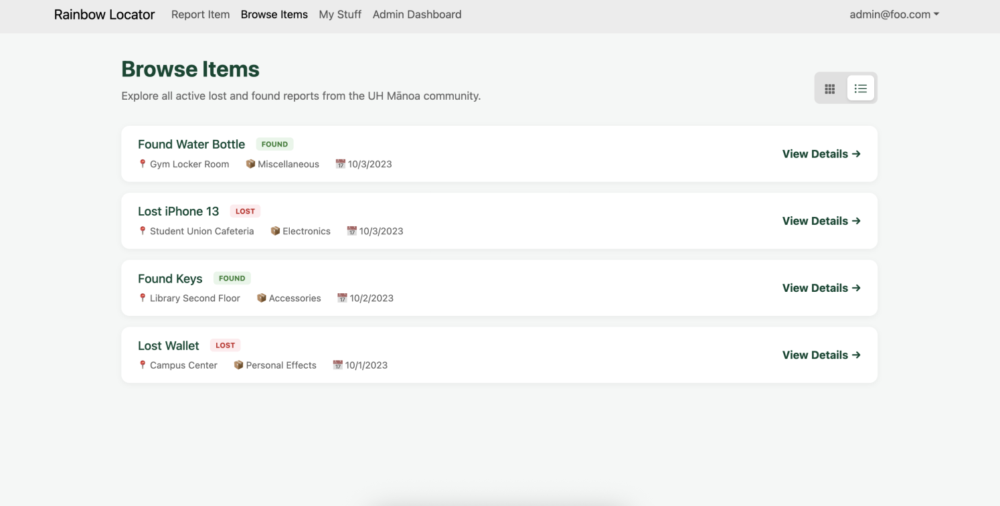

# Rainbow Locator 

Welcome to Rainbow Locator!

## Links
- [Team Contract](https://docs.google.com/document/d/1jPyax2KjJcxirhOlvrwQXVIuoQ-Braw6GKhe-Pn-XDw/edit?usp=sharing)
- [Deployment](https://rainbowlocator.vercel.app/)
- [Rainbow Locator Repository](https://github.com/pacificbytes/rainbow-locator)

## Project Overview

Our project is to develop a centralized Lost and Found web application specifically for students, faculty, 
and staff at the University of Hawaiʻi at Mānoa. Currently, there is no single, unified platform for reporting and locating lost items on campus.

This system aims to simplify the process of reporting lost and found items by providing a single, easy-to-use platform where users can post, search, and claim items.

The system will eventually provide:
- **~~User Authentication~~** 
- **~~Report Found Items~~**
- **~~Admin Dashboard~~**
- **User Profile**
- **Search and Filter System**

## Team Members

- Hans Beuren Rambayon
- Za'Niyah Smith
- Raeanna Vance

## Mockup Pages | [Milestone 1](https://github.com/orgs/pacificbytes/projects/1)

### Landing Page

### Admin Dashboard

### Browse Items Page

### My Stuff/My Reports

## Mockup Pages | [Milestone 2](https://github.com/orgs/pacificbytes/projects/2)
