# Rainbow Locator - User Guide

Welcome to **Rainbow Locator**, the centralized Lost and Found platform for the University of Hawaiʻi at Mānoa community. This guide will help you navigate the system to report lost items, find found belongings, and manage your activity.

## Table of Contents
- [Rainbow Locator - User Guide](#rainbow-locator---user-guide)
  - [Getting Started](#getting-started)
  - [Reporting an Item](#reporting-an-item)
  - [Browsing and Searching](#browsing-and-searching)
  - [Claiming an Item](#claiming-an-item)
  - [Managing Your Reports](#managing-your-reports)
  - [Your Profile and Settings](#your-profile-and-settings)
  - [Administrator Features](#administrator-features)
  - [Testimonials](#testimonials)

## Getting Started

### Creating an Account
To use the full features of Rainbow Locator, you must sign up with your UH email address.
1. Click on the **Log in / Sign up** dropdown in the navigation bar.
2. Select **Sign up**.
3. Enter your full name, email, and a secure password.

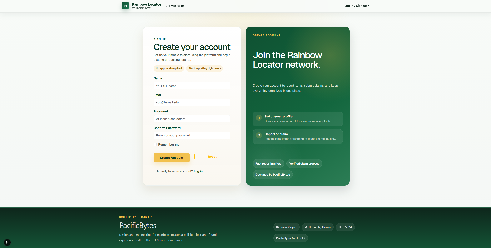

### Logging In
1. Select **Log in** from the navigation bar.
2. Enter your credentials. Once logged in, your name will appear in the top-right corner.

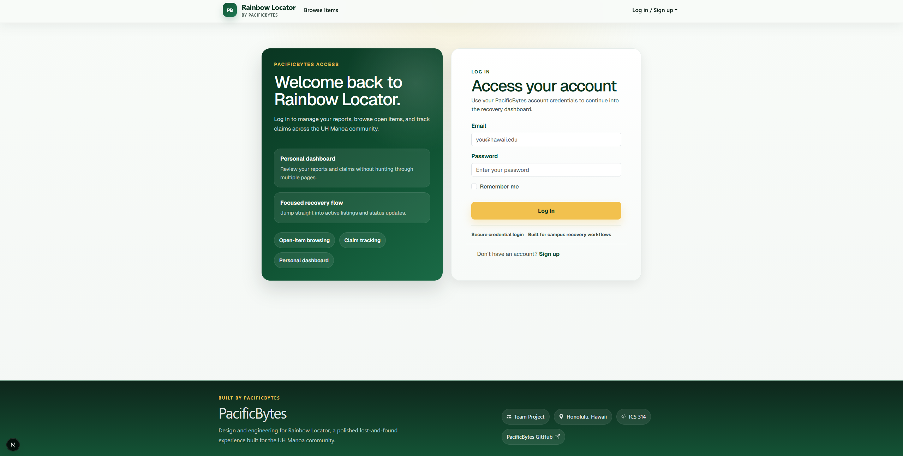
---

## Reporting an Item

If you have lost something or found an item on campus, you can create a report.
1. Click **Report Item** in the navigation bar.
2. Fill out the form with as much detail as possible:
   - **Title**: A clear name (e.g., "Blue Hydro Flask").
   - **Description**: Details like color, brand, or unique stickers.
   - **Category**: Electronics, Accessories, Personal Effects, etc.
   - **Type**: Select whether the item is **Lost** or **Found**.
   - **Location**: Be specific (e.g., "Hamilton Library, 2nd Floor").
   - **Date**: When the item was lost or found.
   - **Image**: Upload a photo to help others identify the item (max 5MB).
3. Click **Submit Report**.
   
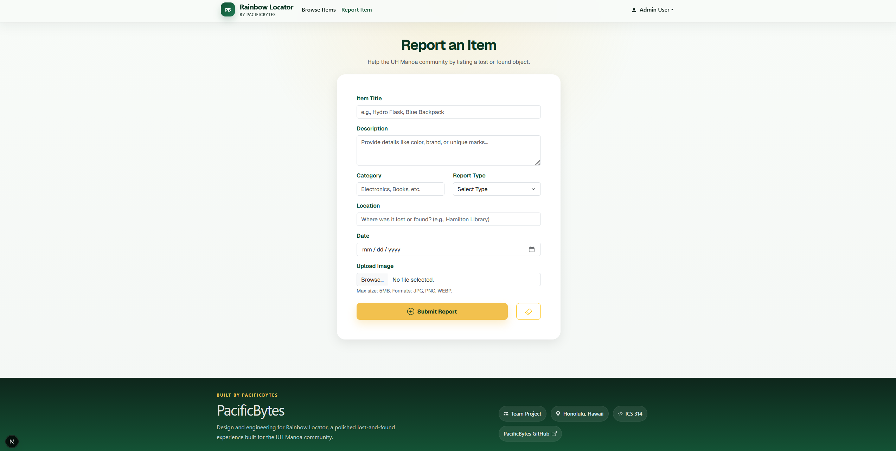

---

## Browsing and Searching

### Browsing Listings
Click **Browse Items** to see a feed of all active reports on campus.
- **Red Badges** indicate Lost items.
- **Green Badges** indicate Found items.

### Searching and Filtering
Use the search bar at the top of the browse page to find specific items by name, description, or location. You can also filter by category or report type to narrow down the results.

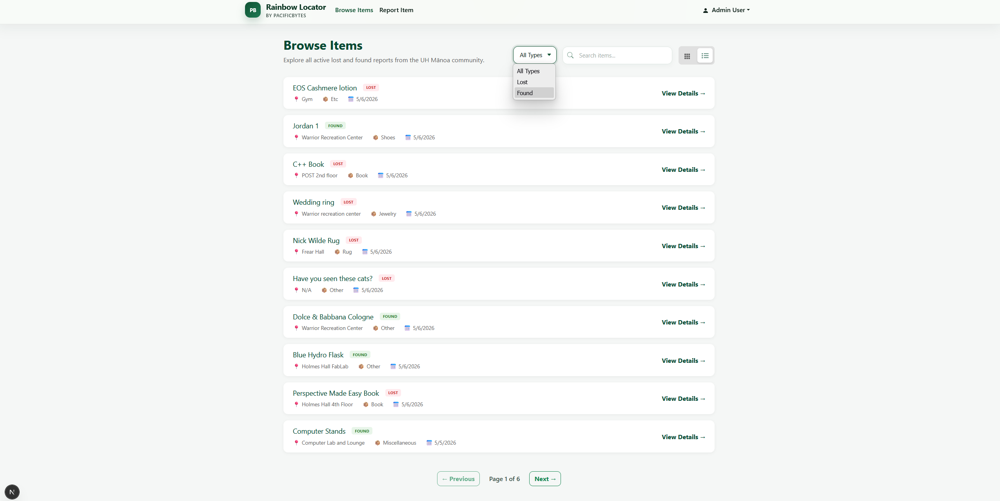
---

## Claiming an Item

If you find your lost item in the feed:
1. Click **View Details** on the item card.
2. If the item belongs to someone else, you will see a **Claim Form**.
3. Write a brief message describing why you believe the item is yours (e.g., "I lost this same bottle yesterday at the CC cafeteria; it has a 'Go Bows' sticker on the bottom").
4. Click **Submit Claim**. The owner will be notified to review your claim.

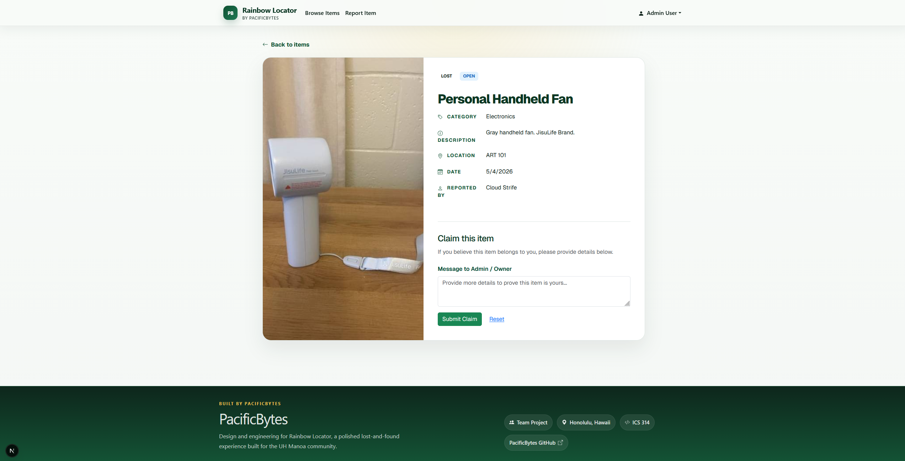
---

## Managing Your Reports

To view everything you have posted or claimed:
1. Click on your name in the navigation bar and select **My Reports**.
2. **My Items**: See all items you have reported. You can **Edit** details or **Delete** the report if the item is recovered.
3. **My Submitted Claims**: Track the status (Pending, Approved, Denied) of claims you have made for other items.
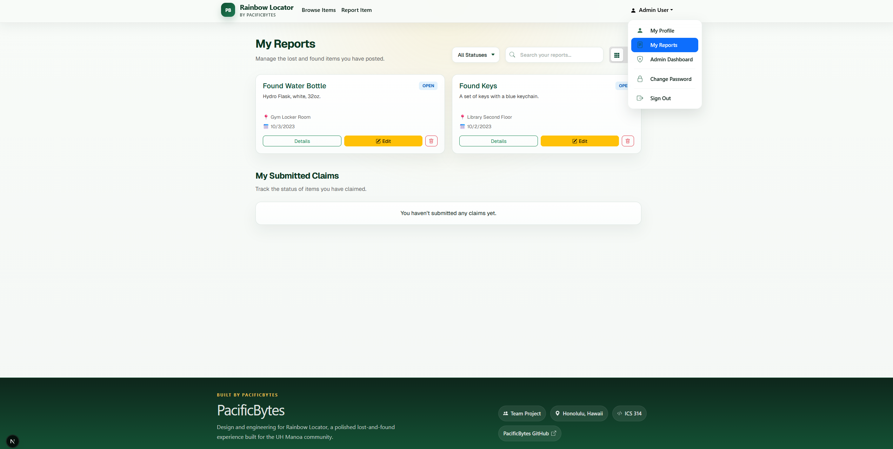
---

## Your Profile and Settings

### Viewing Your Profile
Select **My Profile** from the user dropdown. Here you can see:
- Your account role and join date.
- **Recent Activity**: A timeline of your latest reports and claims.
- **Account Overview**: Quick stats on your total contributions.
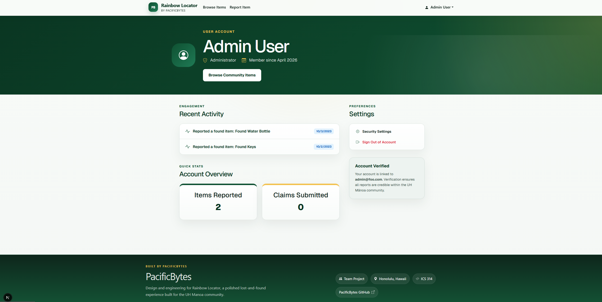
### Changing Your Password
If you need to update your security:
1. Go to **My Profile** and click **Security Settings**, OR select **Change Password** from the Navbar dropdown.
2. Enter your old password followed by your new password.
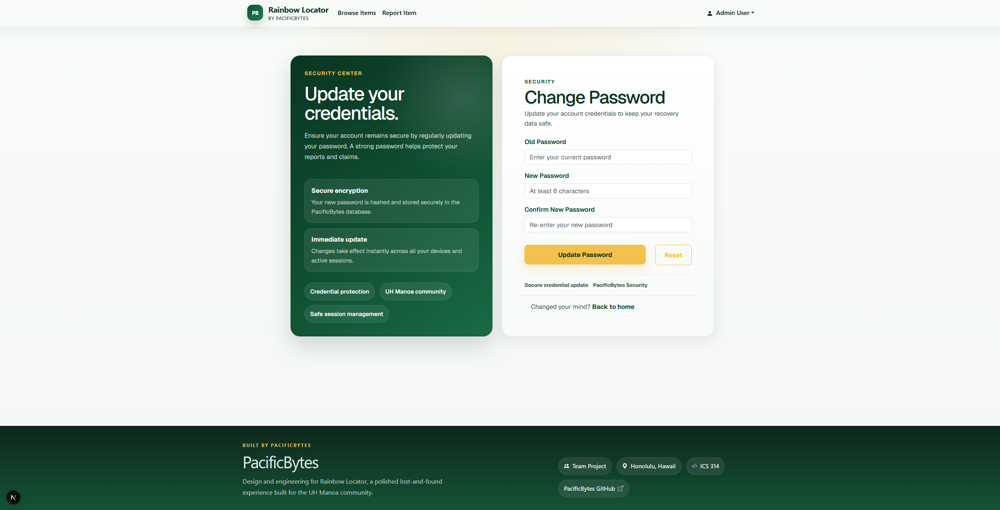

---

## Administrator Features

If you are an administrator, you have access to additional management tools via the **Admin Dashboard** in your dropdown menu:
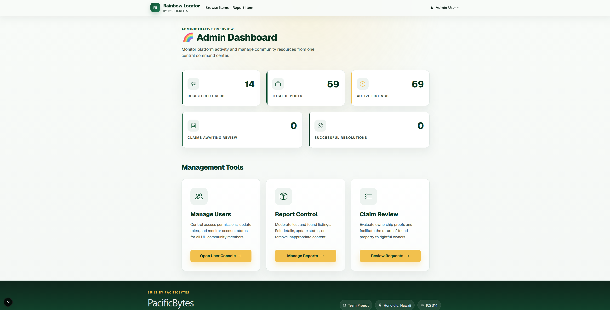
- **Manage Items**: Review, edit, or remove any report on the platform.
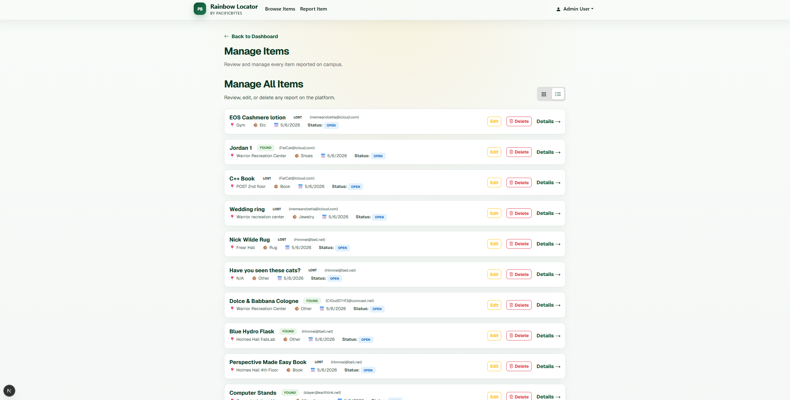
- **Review Claims**: Moderate claims submitted by users.
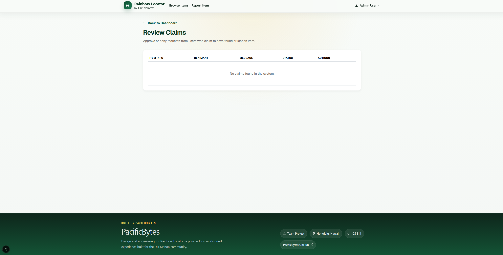
- **Manage Users**: View the user directory and manage account restrictions to keep the community safe.
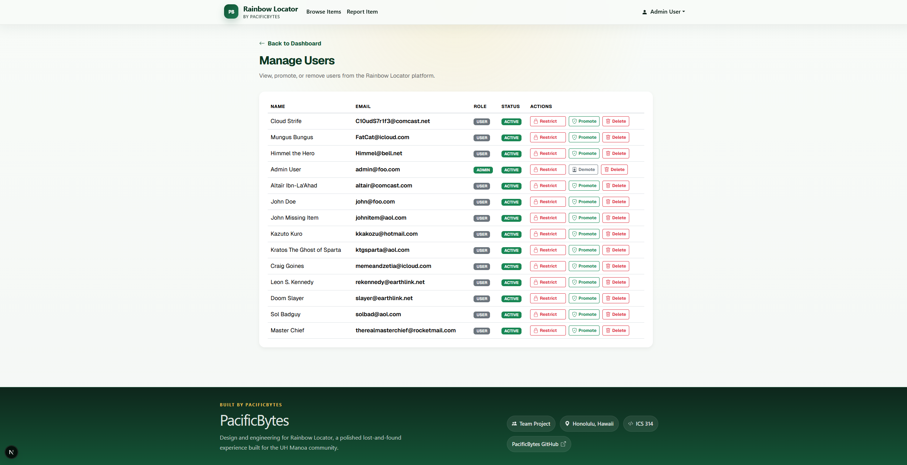

## Testimonials

Below is feedback from users who requested to remain anonymous:

> “Overall, I think the website is fairly intuitive to use, but there are some things I think could be improved on. I think the category of the item should be replaced by some sort of dropdown menu. Likewise, the listing locations left up to the user might be too vague depending on who is posting it. I also think that uploaded images should be visible while browsing items without opening the specific ticket. More than one image should be able to be attached, possibly up to three images.”
> 
> "The website's visual design is impressive and makes it feel like an official UH service. The dashboard is very clean, and I love seeing the real-time stats on the profile. But, the search functionality is dumb because categories aren't standardized. Without a dropdown menu for categories, I have to guess if someone listed their lost item under 'Tech,' 'Electronics,' or 'Phone,' which makes finding things much harder than it should be."
>
> "The reporting form is impressive and uploads images somewhat smoothly, yet the data it collects is often too vague because the location field is left entirely up to the user’s interpretation. To make the platform actually worthwhile for a campus this size, I think the site needs to implement a predefined list of buildings and floors so we aren't stuck searching for items listed simply as being 'at the library'."
>
> " Reporting a found item was really easy and only took me a minute, but the claiming part feels kind of weird because you just send a message and then you’re stuck waiting. There’s no way to actually chat with the person or send them more proof that the item is yours, so it feels like your claim just disappears into a black hole until the admin decides to answer you."
>
> "The new navigation menu in the top corner looks very modern, but the claiming process feels like a total slog once you actually hit the submit button. There’s no way to send a followup message to the person who found your stuff or even show them more proof like a picture of your receipt or a unique mark on the item. If the site had a simple chat feature or a way to keep the conversation going, it would make the whole process feel a lot safer and way more reliable for everyone involved."
